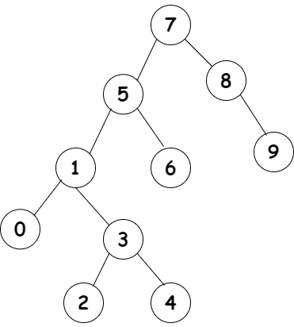

`[7, 5, 1, 8, 3, 6, 0, 9, 4, 2]` dizisinin Binary-Search-Tree aşamalarını yazınız.

Örnek: root x'dir. root'un sağından y bulunur. Solunda z bulunur vb.

---
### Bir node degeri eger bagli oldugu node'un degerinden kucukse solunda, degilse saginda olmalidir.
---
1. H1
    - Root 7'dir.
    - Root'un solunda 5, saginda 8 bulunur.
2. H2
    - 8'in saginda 9 vardir.
    - 5'in solunda 1, saginda 6 bulunur.
3. H3
    - 1'in solunda 0, saginda 3 bulunur. 
4. H4
    - 3'un solunda 2, saginda 4 vardir.

---

