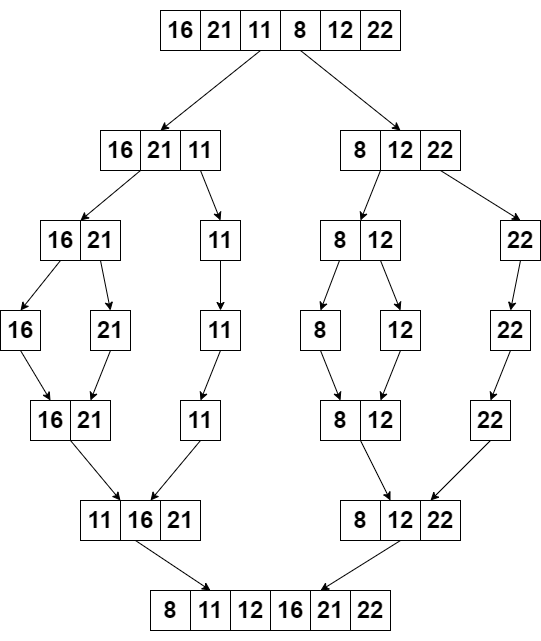

`[16, 21, 11, 8, 12, 22]` -> Merge Sort

- Yukarıdaki dizinin sort türüne göre aşamalarını yazınız.
- Big-O gösterimini yazınız.

---

1. Diziyi ortadan esit olarak ikiye ayirir. `[16, 21, 11]`, `[8, 12, 22]`, Bu ayirma islemi alt diziler en cok iki elemanli olana kadar devam eder.
`[16, 21]`, `[11]`, `[8, 12]`, `[22]`

2. `[16] [21] [11] [8] [12] [22]` Alt diziler kendi icinde siralanir. `[16, 21] [11]`, `[8, 12] [22]`

3. `[11, 16, 21]`, `[8, 12, 22]`

4. `[8, 11, 12, 16, 21, 22]`

---

